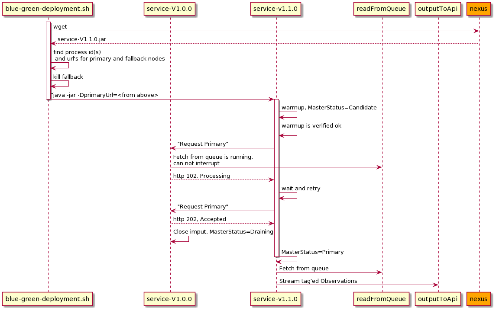
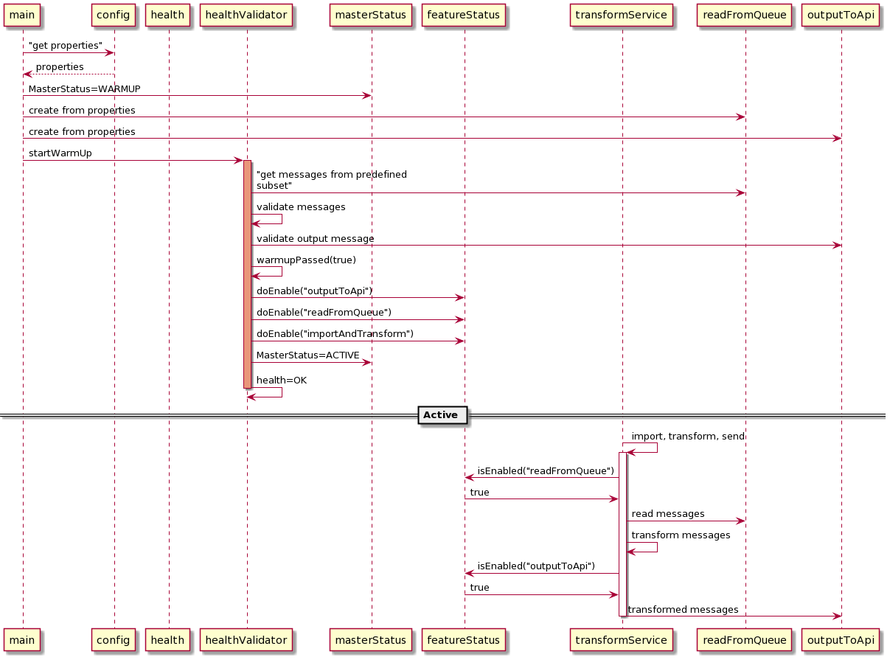

# raspberrypi-blue-green-deployment
Enable continous deployment of java services on a cheep hw.

## Blue/Green deployment of two versions


## Warmup


## Development
```
mvn clean install
java -jar target/blueGreenService.jar
curl -X GET http://localhost:5050/blueGreenService/health
```
